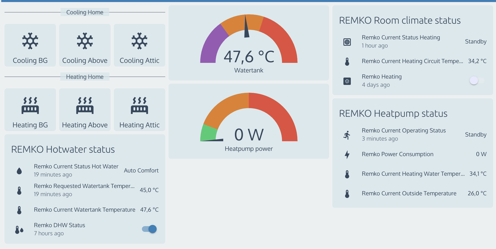

# REMKO.de Heat Pump - Home Assistant Integration

If your REMKO Heat Pump has a SmartControl interface and it has connected to your lan network. You can send POST commands to control settings.



_To have this dashboard also check this template: https://github.com/jovana/remko-heat-pump/wiki/REMKO-Dashboard-template_

## REMKO WKF-Compact
This manual has been tested on a WKF120 device, running software version **4.23**.
https://www.remko.de/en/products/new-energies/smart-heat-pumps/wkf-compact-series/

## Example commands (using curl)
In the below examples you need to replace <YOUR_IP_ADDRESS> first. This IP address you can found in the settings section of your device. Read below how to find your IP Address.

### Switch OFF the Domestic Hot Water Heating
```
curl --request POST \
  --url 'http://<YOUR_IP_ADDRESS>/cgi-bin/webapi.cgi' \
  --header 'Content-Type: application/json' \
  --data '{"SMT_ID": "0000000000000000","query_list":[1079],"values": {"1079":"03"}}'
```

### Switch standby the Heating / Cooling mode
```
curl --request POST \
  --url 'http://<YOUR_IP_ADDRESS>/cgi-bin/webapi.cgi' \
  --header 'Content-Type: application/json' \
  --data '{"SMT_ID": "0000000000000000","query_list":[1088],"values": {"1088":"03"}}'
```

## REMKO Command table (version 4.23)
The table containing command codes can be found here: https://github.com/jovana/remko-heat-pump/wiki/REMKO-Command-table-(version-4.23)


## REMKO Getting values table (version 4.23)
The table containing commands to retrive values can be found here:
https://github.com/jovana/remko-heat-pump/wiki/REMKO-Getting-values-table-(version-4.23)

## Getting your IP Address
Information --> Basic Information --> Status --> Ip Address

## Expert password
To enter the Expert settings, you need a password. The default password is: 0321

# Installing Remko Heatpump Sensors into Home Assistant
1. Copy the folder ```remko_heatpump``` to the ```config/custom_components``` folder of your Home Assistant installation.

2. Add to your configuration.yaml the below line:
```
remko_heatpump:
  # Make sure you have a line break if this is the last line in your configuration.yaml.
```

3. Add the IP address or hostname from the interface into const.py.
Example:
```
BASE_API_URL = "http://192.168.1.68"
```